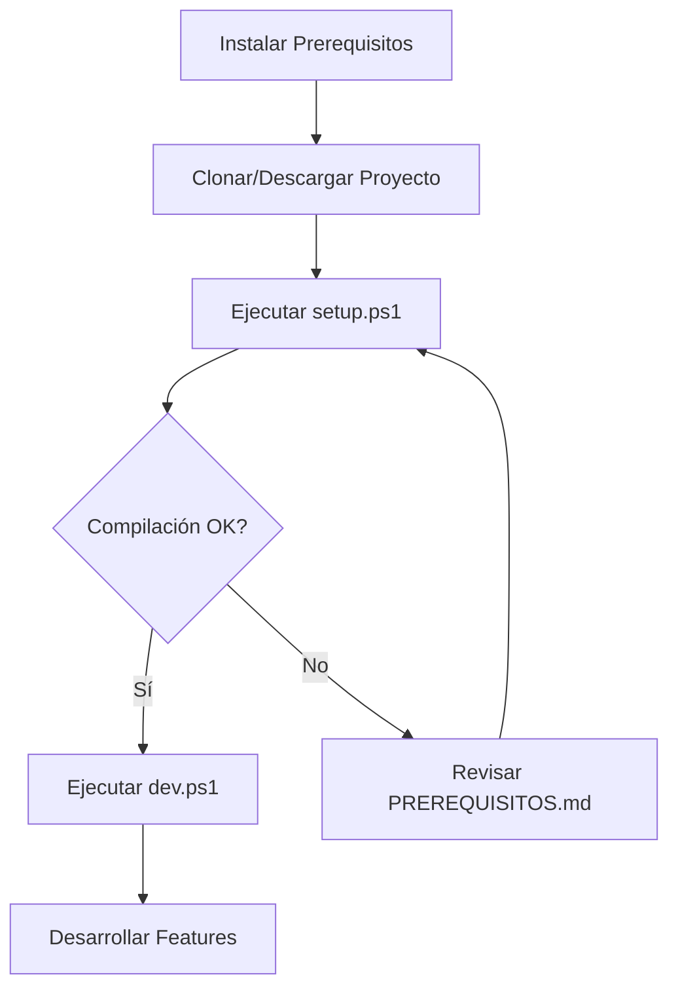

# 📚 Índice de Documentación - Chavalos Server App

Bienvenido a la documentación completa del proyecto **Chavalos Server App**.

---

## 🚀 Inicio Rápido

### Para Usuarios Finales (Tu Mamá)
1. 📖 Lee: [INSTRUCCIONES_MAMA.md](INSTRUCCIONES_MAMA.md)
   - Instalación del MSI
   - Cómo usar la aplicación
   - Solución de problemas básicos

### Para Desarrolladores
1. 📖 Lee: [PREREQUISITOS.md](PREREQUISITOS.md) - Instalar herramientas necesarias
2. 🔧 Ejecuta: `.\setup.ps1` - Configuración inicial
3. 🚀 Ejecuta: `.\dev.ps1` - Modo desarrollo
4. 📖 Lee: [QUICKSTART.md](QUICKSTART.md) - Comandos esenciales

---

## 📖 Documentación por Categoría

### 🎯 Para Usuarios

| Documento | Descripción | Audiencia |
|-----------|-------------|-----------|
| [INSTRUCCIONES_MAMA.md](INSTRUCCIONES_MAMA.md) | Guía paso a paso con lenguaje simple | Usuarios finales sin conocimientos técnicos |

### 👨‍💻 Para Desarrolladores

| Documento | Descripción | Para... |
|-----------|-------------|---------|
| [README.md](README.md) | Documentación técnica completa | Todos los desarrolladores |
| [QUICKSTART.md](QUICKSTART.md) | Comandos rápidos y ejemplos | Desarrollo rápido |
| [PREREQUISITOS.md](PREREQUISITOS.md) | Instalación de herramientas | Primera vez |
| [PROYECTO_RESUMEN.md](PROYECTO_RESUMEN.md) | Arquitectura y decisiones técnicas | Arquitectos/Team Leads |

### 🔧 Scripts Ejecutables

| Script | Propósito | Cuándo usar |
|--------|-----------|-------------|
| `setup.ps1` | Instalación inicial completa | Primera vez |
| `dev.ps1` | Modo desarrollo (hot reload) | Durante desarrollo |
| `build.ps1` | Compilar instalador MSI | Para distribución |
| `setup-icons.ps1` | Configurar iconos | Personalización visual |
| `server-launcher.ps1` | Engine del servidor (no ejecutar directamente) | Interno |

---

## 🗂️ Estructura del Proyecto

```
ChavalosServerApp/
│
├── 📚 DOCUMENTACIÓN
│   ├── README.md                      # Documentación técnica principal
│   ├── QUICKSTART.md                  # Guía rápida
│   ├── INSTRUCCIONES_MAMA.md          # Manual usuario final
│   ├── PREREQUISITOS.md               # Instalación de herramientas
│   ├── PROYECTO_RESUMEN.md            # Arquitectura técnica
│   └── INDICE_DOCUMENTACION.md        # Este archivo
│
├── 🔧 SCRIPTS
│   ├── setup.ps1                      # Setup inicial
│   ├── dev.ps1                        # Modo desarrollo
│   ├── build.ps1                      # Compilar MSI
│   ├── setup-icons.ps1                # Configurar iconos
│   └── server-launcher.ps1            # Engine PowerShell
│
├── ⚙️ CONFIGURACIÓN
│   ├── package.json                   # Dependencias Node
│   ├── vite.config.ts                 # Config Vite
│   ├── tsconfig.json                  # Config TypeScript
│   └── .gitignore
│
├── 🎨 FRONTEND (src/)
│   ├── main.tsx                       # Entry point React
│   ├── App.tsx                        # UI principal
│   └── App.css                        # Estilos
│
├── 🦀 BACKEND (src-tauri/)
│   ├── Cargo.toml                     # Dependencias Rust
│   ├── tauri.conf.json                # Config Tauri
│   ├── build.rs                       # Build script
│   ├── icons/                         # Iconos de la app
│   └── src/
│       └── main.rs                    # Backend Rust
│
└── 🔨 HERRAMIENTAS (.vscode/)
    ├── extensions.json                # Extensiones recomendadas
    └── settings.json                  # Config VS Code
```

---

## 📋 Flujo de Trabajo Recomendado

### Primera Vez



### Desarrollo Diario

```
1. Abre VS Code en la carpeta del proyecto
2. Ejecuta: .\dev.ps1
3. Edita código (hot reload automático)
4. Prueba en la app
5. Repite 3-4
6. Commit cambios
```

### Para Distribuir

```
1. Asegúrate de que todo funciona (.\dev.ps1)
2. Actualiza versión en package.json y Cargo.toml
3. Ejecuta: .\build.ps1
4. Espera 15-20 minutos
5. Obtén el MSI de: src-tauri\target\release\bundle\msi\
6. Distribuye el archivo .msi
```

---

## 🎓 Tutoriales Paso a Paso

### Tutorial 1: Modificar Colores de la UI

1. Abre `src/App.tsx`
2. Busca las constantes de color (líneas con `#667eea`, `#764ba2`, etc.)
3. Cámbiolas por tus colores preferidos
4. Guarda (hot reload automático)
5. Verifica en la app

### Tutorial 2: Agregar un Nuevo Botón

1. En `src/App.tsx`, ubica el componente `App`
2. Encuentra la sección de botones (línea ~250)
3. Agrega tu botón:
```typescript
<button
  onClick={handleMiAccion}
  style={{ padding: '12px 24px', background: '#10b981', ... }}
>
  Mi Botón
</button>
```
4. Crea la función handler:
```typescript
const handleMiAccion = async () => {
  // Tu lógica aquí
  addLog('Mi acción ejecutada', 'info');
};
```
5. Guarda y prueba

### Tutorial 3: Crear un Comando Rust Nuevo

1. Abre `src-tauri/src/main.rs`
2. Define tu comando:
```rust
#[tauri::command]
fn mi_comando(param: String) -> Result<String, String> {
    Ok(format!("Recibido: {}", param))
}
```
3. Regístralo en el handler:
```rust
.invoke_handler(tauri::generate_handler![
    // ... comandos existentes
    mi_comando,
])
```
4. Desde React, llámalo:
```typescript
const resultado = await invoke<string>('mi_comando', { param: 'test' });
```

### Tutorial 4: Modificar el Script PowerShell

1. Abre `server-launcher.ps1`
2. Ubica la sección que quieres modificar
3. Edita cuidadosamente (mantén el formato de logs)
4. Prueba ejecutándolo directamente:
```powershell
.\server-launcher.ps1 -ProjectPath "D:\Aquiles\Tienda_Chavalos_Virtual_web" -Mode dev -Port 3000
```
5. Si funciona, prueba desde la app

---

## 🔍 Búsqueda Rápida

### "¿Cómo hago para...?"

| Tarea | Archivo | Línea Aprox. |
|-------|---------|--------------|
| Cambiar puerto predeterminado | `src-tauri/src/main.rs` | 48 |
| Modificar UI principal | `src/App.tsx` | 90-400 |
| Agregar nuevo comando Tauri | `src-tauri/src/main.rs` | 200-300 |
| Personalizar colores | `src/App.tsx` | Buscar `#667eea` |
| Modificar lógica del servidor | `server-launcher.ps1` | Todo el archivo |
| Cambiar configuración de ventana | `src-tauri/tauri.conf.json` | 45-60 |
| Editar metadata del instalador | `src-tauri/tauri.conf.json` | 18-35 |

---

## 📞 Soporte y Recursos

### Documentación Oficial de Tecnologías

- **Tauri**: https://tauri.app/v1/guides/
- **Rust**: https://doc.rust-lang.org/book/
- **React**: https://react.dev/learn
- **TypeScript**: https://www.typescriptlang.org/docs/
- **Vite**: https://vitejs.dev/guide/

### Comunidades

- **Tauri Discord**: https://discord.gg/tauri
- **Stack Overflow**: Busca tags `[tauri]`, `[rust]`, `[react]`
- **GitHub Issues**: Para reportar bugs en las dependencias

### Videos Tutoriales

- **Tauri Basics**: Busca en YouTube "Tauri tutorial"
- **Rust for Beginners**: https://www.youtube.com/rustlang
- **React Hooks**: https://react.dev/learn

---

## 🐛 Solución de Problemas

### Por Tipo de Problema

| Problema | Documento | Sección |
|----------|-----------|---------|
| Errores de instalación | [PREREQUISITOS.md](PREREQUISITOS.md) | "Problemas Comunes" |
| App no inicia | [README.md](README.md) | "Solución de Problemas" |
| Build falla | [README.md](README.md) | "Build falla con error de Rust" |
| Docker no responde | [INSTRUCCIONES_MAMA.md](INSTRUCCIONES_MAMA.md) | "¿Qué hacer si...?" |
| Errores de Rust | [PREREQUISITOS.md](PREREQUISITOS.md) | "link.exe not found" |

### Checklist de Debugging

```
□ Todos los prerequisitos instalados? (.\check-prerequisites.ps1)
□ Docker Desktop está corriendo?
□ Proyecto principal existe en la ruta configurada?
□ Logs muestran error específico? (Exportar logs)
□ Reiniciar la app ayudó?
□ Limpiar cache: Remove-Item -Recurse node_modules, src-tauri/target
```

---

## 📊 Glosario de Términos

| Término | Significado |
|---------|-------------|
| **Tauri** | Framework para crear apps de escritorio con web tech |
| **Rust** | Lenguaje de programación para el backend |
| **React** | Librería JavaScript para UI |
| **Vite** | Build tool rápido para frontend |
| **MSI** | Windows Installer (archivo .msi) |
| **Tray** | Bandeja del sistema (área de notificaciones) |
| **Hot Reload** | Cambios se reflejan automáticamente sin reiniciar |
| **Spawn** | Crear un proceso hijo (ejecutar programa) |
| **Invoke** | Llamar un comando Rust desde React |
| **Emit** | Enviar evento desde Rust a React |

---

## 📅 Roadmap de Aprendizaje

### Semana 1: Familiarización
- ✅ Instalar prerequisitos
- ✅ Ejecutar en modo desarrollo
- ✅ Entender estructura del proyecto
- ✅ Modificar colores/textos simples

### Semana 2: Frontend
- ✅ React basics (si no lo sabes)
- ✅ Agregar botones nuevos
- ✅ Modificar el layout
- ✅ Entender el estado (useState, useEffect)

### Semana 3: Backend
- ✅ Rust basics (conceptos principales)
- ✅ Crear un comando Tauri simple
- ✅ Modificar comandos existentes
- ✅ Entender el sistema de eventos

### Semana 4: PowerShell
- ✅ Entender el script launcher
- ✅ Modificar comportamiento del servidor
- ✅ Agregar verificaciones adicionales
- ✅ Mejorar manejo de errores

### Semana 5+: Avanzado
- ✅ Compilar MSI exitosamente
- ✅ Agregar features nuevas (health check, stats)
- ✅ Optimizar rendimiento
- ✅ Contribuir mejoras al proyecto

---

## 🎓 Certificación de Conocimiento

Después de trabajar con el proyecto, deberías poder responder:

### Nivel Básico
- ✓ ¿Cómo inicio la app en modo desarrollo?
- ✓ ¿Dónde están los archivos del frontend?
- ✓ ¿Cómo cambio un texto o color en la UI?

### Nivel Intermedio
- ✓ ¿Cómo funciona la comunicación React ↔ Rust?
- ✓ ¿Cómo agrego un nuevo botón con funcionalidad?
- ✓ ¿Qué hace el script PowerShell paso a paso?

### Nivel Avanzado
- ✓ ¿Cómo creo un comando Tauri personalizado?
- ✓ ¿Cómo manejo procesos en Rust?
- ✓ ¿Cómo compilo y distribuyo el MSI?

---

## ✅ Checklist de Proyecto Completado

Antes de considerar el proyecto "terminado", verifica:

### Funcionalidad
- [ ] Inicia el servidor correctamente
- [ ] Detiene el servidor sin dejar procesos
- [ ] Logs se muestran en tiempo real
- [ ] Botones funcionan según lo esperado
- [ ] Sistema de bandeja funcional
- [ ] Configuración se guarda y carga
- [ ] QR se genera y abre
- [ ] Exportar logs funciona

### Calidad
- [ ] No hay errores en consola de desarrollo
- [ ] UI responde rápido (no lag)
- [ ] Mensajes de error son claros
- [ ] Documentación actualizada
- [ ] Código comentado donde es complejo

### Distribución
- [ ] Build.ps1 genera MSI exitosamente
- [ ] MSI instala correctamente
- [ ] Iconos correctos (no defaults)
- [ ] Metadata completa (versión, autor, etc.)
- [ ] INSTRUCCIONES_MAMA.md actualizado

---

## 🎉 ¡Felicidades!

Si llegaste hasta aquí, ya conoces todo lo necesario para trabajar con el proyecto.

**Recuerda**:
- 📖 La documentación está para consultarla cuando lo necesites
- 🐛 Los errores son oportunidades de aprendizaje
- 💬 No dudes en buscar ayuda cuando la necesites
- 🚀 Empieza simple y ve agregando complejidad gradualmente

---

**Última actualización**: Enero 2026  
**Versión de la documentación**: 1.0.0  

---

_Hecho con ❤️ para Ferretería Chavalos_
